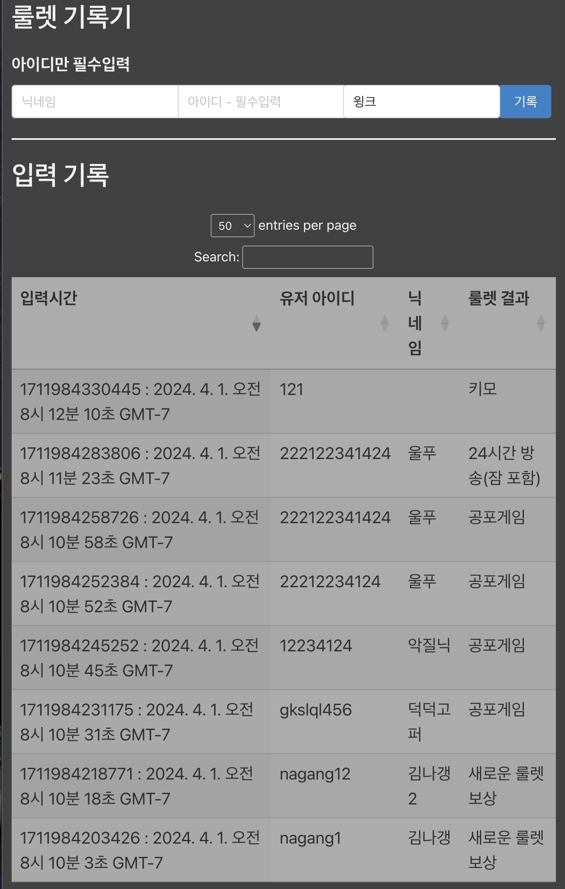

# roulette-auto-entry
Custom UI for Google Sheet entry for afreehp roulette service

!!!
This is a derived project from the previous trial; https://github.com/marshyunlee/roulette-recorder; it is currently on-hold due to the bugs from AfreeHP side, which's uncontrollable on my end.  
While this version is not a full-automatic recordings of roulette results, but this provides a better, semi-automatic record entry to the target Google Sheet.

## Pre-requisite
- https://chromewebstore.google.com/detail/lfhmikememgdcahcdlaciloancbhjino
This is needed to bypass CORS restriction. While this is just a toy project which's not meant for prod-distribution,  
I don't wish to look for any fancy workaround like private-proxy or nice node.js middleware.


## Import Issue Solution
eh... just run the following and make sure to include bundle.js in the html header instead of import/require statements
```
npm install -g browserify
browserify import.js -o bundle.js
```

## Design Overview

afreehp's roulette information does not convey any useful information via html, and they do not provide any official API to retrieve the roulette rewards.
For example; [this view](https://afreehp.kr/slot/VZiXlq2a) html does not include the actual roulette, but the placeholder's replaced by local calculation


## Dependencies
- afreehp's public roulette information
- Google Sheep - Apps Script + GCP
- AfreecaTV public search URL for user query

## Expected UI WIP



## Required Data Specs
### User Input
- afreehp roulette info web address
- Google Sheet custom API address

### Internal Data Transportation
FE -> afreehp; provided URL  
App -> AfreecaTV search; UID/nickname  
App -> GCP  
```
{
	"uid": "",      // string literal - afreeca user ID
	"nickname": "", // string literal - afreeca user nickcname
	"result": "",   // string literal - afreehp roulette output
	"timestamp": 0  // numeric - unixtime ummm maybe unixnano?
}
```

## Components
### Views
- [index.html](./index.html)
- [recorder.html](./recorder.html)

### Scripts
- [app.js](./app.js)
- [index.js](./index.js)


### Further TODO?
idk it's just an overnight project